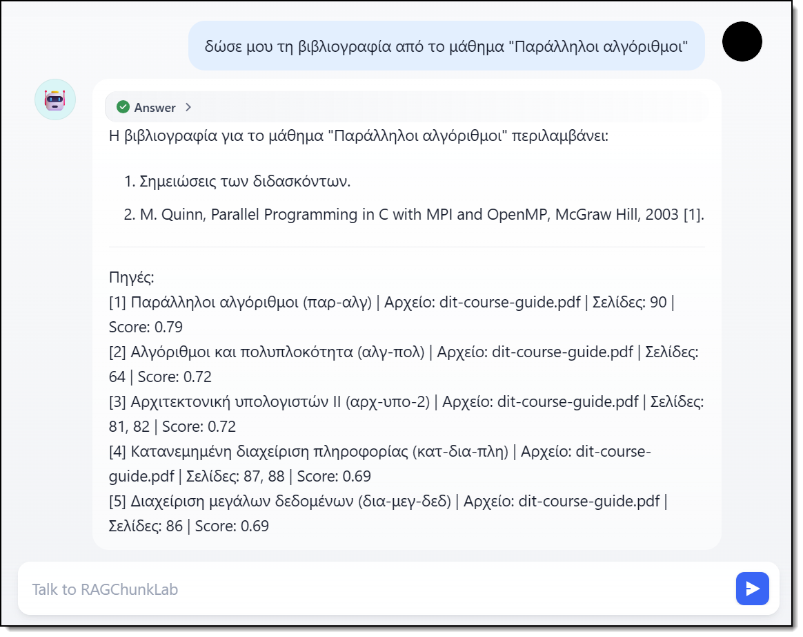
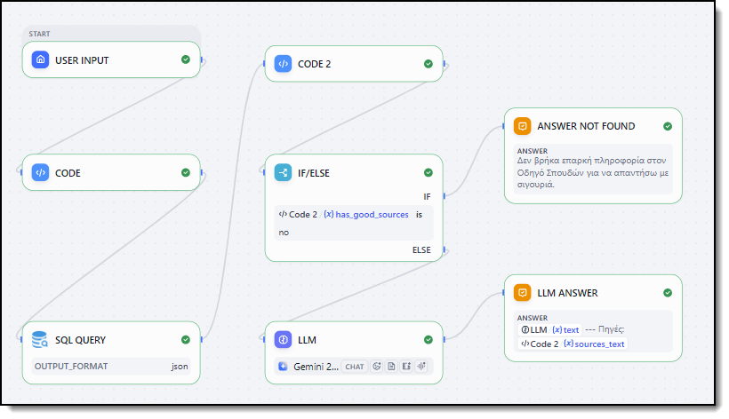

# Συγκριτική Μελέτη Στρατηγικών Chunking σε συστήματα RAG για μεγάλα (ακαδημαϊκά) έγγραφα

---

## 1. Εισαγωγή

Τα Μεγάλα Γλωσσικά Μοντέλα (Large Language Models - LLMs) εντυπωσιάζουν με την ικανότητά τους να κατανοούν και να παράγουν κείμενο. Ωστόσο, έχουν σημαντικούς περιορισμούς όταν απαιτείται η απάντηση σε εξειδικευμένες ερωτήσεις. Συχνά υφίσταται το φαινόμενο των "ψευδαισθήσεων" (hallucinations), όπου παράγονται πειστικές αλλά εσφαλμένες απαντήσεις, ενώ παράλληλα απουσιάζει η πρόσβαση σε ιδιωτικά δεδομένα.

Η τεχνολογία **Retrieval-Augmented Generation (RAG)** προσφέρει μια πρακτική λύση σε αυτό το πρόβλημα. Συνδυάζει τη δύναμη των LLMs με συστήματα αναζήτησης, λειτουργώντας σε δύο βήματα: αρχικά εντοπίζονται τα σχετικά έγγραφα σε μια τοπική βάση και στη συνέχεια τροφοδοτούνται στο μοντέλο για να συντεθεί η τελική απάντηση.

Μία από τις πιο κρίσιμες παραμέτρους για την επιτυχία ενός συστήματος RAG είναι ο τρόπος τεμαχισμού (chunking) του αρχικού κειμένου. Καθώς δεν είναι δυνατή η εισαγωγή ενός ολόκληρου βιβλίου στο μοντέλο, ο τεμαχισμός του κειμένου σε μικρότερα, διαχειρίσιμα κομμάτια είναι αναγκαίος. Στόχος αυτής της εργασίας είναι να εξεταστούν συγκριτικά πέντε διαφορετικές στρατηγικές διαμερισμού (chunking) και να αξιολογηθεί η αποτελεσματικότητά τους σε πραγματικά δεδομένα από ακαδημαϊκούς οδηγούς σπουδών.

---

## 2. Βασικές Έννοιες

### 2.1. Retrieval-Augmented Generation (RAG)
Αποτελεί μια τεχνική που εμπλουτίζει τα μοντέλα τεχνητής νοημοσύνης με εξωτερική γνώση. Όταν υποβάλλεται μια ερώτηση, το σύστημα RAG αναζητά δυναμικά πληροφορίες από τη βάση δεδομένων και δεσμεύει το μοντέλο να βασίσει την απάντησή του αποκλειστικά σε αυτές, μειώνοντας δραστικά τα σφάλματα.

### 2.2. Embeddings (Διανυσματικές αναπαραστάσεις)
Τα embeddings είναι μια μέθοδος μετατροπής του κειμένου σε αριθμητικές τιμές. Κάθε λέξη ή πρόταση μετατρέπεται σε ένα "διάνυσμα" (vector). Το πλεονέκτημα είναι ότι προτάσεις με παρόμοιο νόημα αποκτούν παρόμοιες διανυσματικές τιμές, επιτρέποντας στο σύστημα να πραγματοποιεί αναζήτηση με βάση το νόημα (semantic search) και όχι την απλή αντιστοίχιση λέξεων-κλειδιών.

### 2.3. Βάσεις Δεδομένων Διανυσμάτων (Vector Databases)
Πρόκειται για ειδικές βάσεις δεδομένων, σχεδιασμένες για την ταχεία αποθήκευση και αναζήτηση διανυσμάτων. Η λειτουργία τους βασίζεται στην εύρεση των διανυσμάτων που εμφανίζουν τη μεγαλύτερη ομοιότητα (απόσταση) με το διάνυσμα της ερώτησης.

### 2.4. Chunking (τεμαχισμός κειμένου)
Ο τεμαχισμός είναι η διαδικασία διάσπασης ενός μεγάλου εγγράφου σε μικρότερα τμήματα (chunks). Είναι απαραίτητος, καθώς τα LLMs έχουν περιορισμένο όριο (context window) ανάγνωσης. Εάν ο τεμαχισμός δεν πραγματοποιηθεί σωστά, σημαντικές πληροφορίες ενδέχεται να αποκοπούν, προκαλώντας αστοχίες στο σύστημα αναζήτησης.

---

## 3. Περιγραφή δεδομένων 

Για τις ανάγκες της αξιολόγησης, επεξεργάστηκαν δύο έγγραφα PDF από το Πανεπιστήμιο Πελοποννήσου, τα οποία εμφανίζουν περίπλοκη δομή:
1. **Οδηγός προπτυχιακών σπουδών (Τμήματος Πληροφορικής και Τηλεπικοινωνιών)** (`dit-course-guide.pdf`): Περιλαμβάνει 142 σελίδες με εκτενείς περιγραφές μαθημάτων, κωδικούς, πίνακες και λίστες με προαπαιτούμενα.
2. **Οδηγός μεταπτυχιακών σπουδών (Π.Μ.Σ. στην Επιστήμη Υπολογιστών)** (`odigos-spoudon-2023.pdf`): Αντίστοιχο έγγραφο 73 σελίδων προσαρμοσμένο στο πρόγραμμα του μεταπτυχιακού.

Και τα δύο έγγραφα έχουν κοινή λογική δομή: αποτελούνται από διαδοχικές περιγραφές μαθημάτων. Κάθε μάθημα περιγράφεται με ένα τυποποιημένο σύνολο πληροφοριών, που περιλαμβάνει τον τίτλο, τον κωδικό του μαθήματος, τον αριθμό των πιστωτικών μονάδων ECTS, το εξάμηνο, τη γλώσσα διδασκαλίας, τα προαπαιτούμενα, τα μαθησιακά αποτελέσματα, το περιεχόμενο, τον τρόπο αξιολόγησης και τη βιβλιογραφία. Πρόκειται δηλαδή για μεγάλα έγγραφα με έντονα επαναλαμβανόμενη και προβλέψιμη εσωτερική δομή.

---

## 4. Αρχιτεκτονική συστήματος

Το σύστημα αναπτύχθηκε σε γλώσσα Python, ενσωματώνοντας τα εξής στοιχεία:
*   **Βάση δεδομένων (Vector Store):** Χρησιμοποιήθηκε η PostgreSQL μαζί με το extension `pgvector`. Αυτό επέτρεψε την αποθήκευση των τμημάτων κειμένου ως διανύσματα. Κάθε στρατηγική chunking αποθήκευσε τα δεδομένα της σε έναν διακριτό, απομονωμένο πίνακα στη βάση δεδομένων.
*   **Μοντέλο embeddings:** Το μοντέλο `gemini-embedding-001` μετέτρεψε το κείμενο σε διανύσματα διαστάσεων 1536. Η αναζήτηση της ομοιότητας πραγματοποιήθηκε χρησιμοποιώντας τη μετρική Cosine Similarity.
*   **Μοντέλο γλώσσας (LLM):** Η τελική απάντηση του συστήματος συντέθηκε χρησιμοποιώντας το μοντέλο `gemini-2.5-flash-lite`.

### Πίνακες βάσης δεδομένων και πλήθος chunks

Παρακάτω παρουσιάζεται η αντιστοίχιση των στρατηγικών chunking με τους αντίστοιχους πίνακες της PostgreSQL, καθώς και το πλήθος των chunks που παρήχθησαν για κάθε ένα από τα δύο έγγραφα:

| Στρατηγική Chunking | Πίνακας PostgreSQL | dit-course-guide.pdf | odigos-spoudon-2023.pdf | Συνολικά Chunks |
| :--- | :--- | :---: | :---: | :---: |
| **Structural** | `chunks_structural` | 110 | 17 | 127 |
| **Fixed-Size** | `chunks_fixed_size` | 416 | 161 | 577 |
| **Recursive** | `chunks_recursive` | 434 | 166 | 600 |
| **Semantic** | `chunks_semantic` | 314 | 84 | 398 |
| **Page-Based** | `chunks_page` | 140 | 73 | 213 |

---

## 5. Στρατηγικές chunking

Για να διαπιστωθεί ποια μέθοδος λειτουργεί καλύτερα, αναπτύχθηκαν και συγκρίθηκαν πέντε διαφορετικές στρατηγικές διαμερισμού:

### 5.1. Page-Based Chunking (τεμαχισμός ανά σελίδα)
Η πιο απλή προσέγγιση: Κάθε σελίδα του PDF μετατρέπεται σε ένα ενιαίο chunk.
*   **Πλεονεκτήματα:** Εξαιρετικά απλή στην υλοποίηση και επιτρέπει την άμεση αντιστοίχιση της ανακτηθείσας πληροφορίας με τη φυσική σελίδα του εγγράφου.
*   **Μειονεκτήματα:** Προκαλεί σοβαρά προβλήματα (context fragmentation) όταν οι πληροφορίες μιας ενότητας (π.χ. ενός μαθήματος) εκτείνονται σε δύο διαδοχικές σελίδες, οδηγώντας σε απώλεια σημαντικού πλαισίου.

### 5.2. Fixed-Size Chunking (σταθερό μέγεθος)
Σε αυτή τη μέθοδο, το κείμενο κόβεται αυστηρά σε συγκεκριμένο αριθμό χαρακτήρων (1000) με μια μικρή επικάλυψη (overlap των 100 χαρακτήρων).
*   **Πλεονεκτήματα:** Δημιουργεί ομοιόμορφα διανύσματα σταθερού μεγέθους και είναι εξαιρετικά εύκολη στην παραμετροποίηση.
*   **Μειονεκτήματα:** Ενέχει τον κίνδυνο της "τυφλής" κοπής, αγνοώντας πλήρως τη σύνταξη και τη δομή του κειμένου. Συχνά αλλοιώνει το νόημα προτάσεων και αποκόπτει σχετικές λέξεις.

### 5.3. Recursive Character Splitting (αναδρομικός διαχωρισμός)
Αποτελεί μια πιο δομημένη παραλλαγή του σταθερού μεγέθους. Το σύστημα επιχειρεί να διαιρέσει το κείμενο σε λογικά σημεία: αναζητά πρώτα παραγράφους, κατόπιν αλλαγές γραμμής και τέλος τελείες.
*   **Πλεονεκτήματα:** Σέβεται σε μεγάλο βαθμό τα όρια των προτάσεων και των παραγράφων, βελτιώνοντας τη σημασιολογική συνοχή σε σχέση με τη μέθοδο Fixed-Size.
*   **Μειονεκτήματα:** Σε δομημένα έγγραφα (π.χ. λίστες προαπαιτούμενων), η φυσική έννοια της παραγράφου δεν ταυτίζεται απαραίτητα με τη λογική ενότητα, με αποτέλεσμα τον διασκορπισμό της πληροφορίας.

### 5.4. Semantic Chunking (σημασιολογικός διαχωρισμός)
Αυτή η τεχνική υπολογίζει τα embeddings για κάθε μεμονωμένη πρόταση. Όταν ανιχνευθεί σημαντική αλλαγή θέματος, το κείμενο διαχωρίζεται.
*   **Πλεονεκτήματα:** Ιδανική για κείμενα συνεχούς ροής, καθώς ομαδοποιεί τις προτάσεις δυναμικά με βάση το νόημά τους και όχι αυθαίρετους κανόνες.
*   **Μειονεκτήματα:** Απέτυχε στα εξεταζόμενα έγγραφα-καταλόγους, καθώς η μετάβαση από τα "Μαθησιακά Αποτελέσματα" ενός μαθήματος στη "Βιβλιογραφία" του, εκλήφθηκε εσφαλμένα ως "αλλαγή θέματος", αποκόπτοντας τα δεδομένα.

### 5.5. Structural Chunking (δομικός τεμαχισμός)
Αυτή η στρατηγική προσαρμόστηκε ειδικά στη μορφολογία των συγκεκριμένων PDF εγγράφων. Μέσω Regular Expressions, το σύστημα εντοπίζει τον τίτλο και τον κωδικό κάθε μαθήματος, τοποθετώντας όλες τις σχετικές λεπτομέρειες εντός ενός ενιαίου chunk.
*   **Πλεονεκτήματα:** Μεγιστοποιεί την ακεραιότητα του πλαισίου (context integrity). Όλες οι πληροφορίες ενός μαθήματος διατηρούνται αδιαίρετες στον ίδιο διανυσματικό χώρο, οδηγώντας σε άριστα αποτελέσματα ανάκτησης.
*   **Μειονεκτήματα:** Υψηλή εξάρτηση από το format του εγγράφου. Απαιτεί χειροκίνητη ανάπτυξη κανόνων προσαρμοσμένων στο συγκεκριμένο έγγραφο, μειώνοντας τη δυνατότητα άμεσης γενίκευσης σε άλλους τύπους αρχείων.

---

## 6. Πειραματική διαδικασία

Η αξιολόγηση των μεθόδων στηρίχθηκε σε μια αυτοματοποιημένη πειραματική διαδικασία. Για το σκοπό αυτό, παρήχθησαν συνθετικά, αλλά βασισμένα στο περιεχόμενο των δύο PDF, **100 ζεύγη ερωτήσεων-απαντήσεων** (QA pairs) - 50 για κάθε Οδηγό Σπουδών - με τη χρήση του LLM μοντέλου Gemini (το οποίο παρήγαγε τα δομημένα αρχεία JSON). Οι ερωτήσεις σχεδιάστηκαν ώστε να καλύπτουν ποικίλες πληροφορίες (π.χ. προαπαιτούμενα, διδάσκοντες, μαθησιακά αποτελέσματα) και να ανταποκρίνονται σε πραγματικά σενάρια αναζήτησης χρηστών.

Για την ολοκληρωμένη σύγκριση των στρατηγικών, χρησιμοποιήθηκαν μετρικές σε δύο άξονες:

**Α. Μετρικές ακρίβειας (Accuracy Metrics)**
1. **Top-1 Hit Rate:** Ποσοστό περιπτώσεων όπου το σύστημα εντόπισε το πλέον σχετικό κείμενο ως πρώτη επιλογή.
2. **Top-5 Hit Rate:** Ποσοστό περιπτώσεων όπου η σωστή απάντηση βρισκόταν στα κορυφαία 5 αποτελέσματα.
3. **Mean Reciprocal Rank (MRR):** Μια στατιστική μετρική που αξιολογεί την κατάταξη της σωστής απάντησης (όσο πιο κοντά στο 1.0, τόσο πιο ιδανική η ταξινόμηση).

**Β. Λειτουργικές μετρικές (Operational Metrics)**

**Context Load (token usage):** Μέτρηση του συνολικού μεγέθους των δεδομένων (σε tokens) που ανακτώνται και αποστέλλονται στο LLM ανά ερώτηση. Είναι η κρισιμότερη μετρική για τον υπολογισμό του οικονομικού κόστους (API calls cost) και της ταχύτητας απόκρισης (latency).

---

## 7. Αποτελέσματα και ανάλυση

Ο παρακάτω πίνακας αποτυπώνει την αποτελεσματικότητα της κάθε στρατηγικής στις 100 ερωτήσεις δοκιμής:

| Στρατηγική Chunking | Top-1 Hit Rate | Top-5 Hit Rate | MRR | Avg Tokens/Chunk | Avg Context Load |
| :--- | :---: | :---: | :---: | :---: | :---: |
| **Structural (1 Μάθημα = 1 Chunk)** | **94.00%** | **100.00%** | **0.970** | **1248** | **6241** |
| Fixed-Size (1000 χαρακτήρες) | 32.00% | 49.00% | 0.395 | 448 | 1976 |
| Semantic Chunking | 22.00% | 30.00% | 0.248 | 471 | 2300 |
| Recursive Splitting | 20.00% | 31.00% | 0.249 | 424 | 1717 |
| Page-Based (1 Σελίδα = 1 Chunk) | 13.00% | 15.00% | 0.138 | 1185 | 5570 |

### Ανάλυση ευρημάτων
Τα δεδομένα δείχνουν την εντυπωσιακή κυριαρχία της μεθόδου **Structural Chunking**, με ποσοστό 94% στις σωστές "πρώτες" απαντήσεις (Top-1). Η επιτυχία αυτή αποδίδεται στη διατήρηση της **Ακεραιότητας του πλαισίου** (context integrity). Όταν όλες οι πληροφορίες ενός μαθήματος (τίτλος, ECTS, βιβλιογραφία) διατηρούνται ενωμένες, το σύστημα RAG είναι σε θέση να επιτύχει τη βέλτιστη συσχέτιση.

Αντιθέτως, οι στρατηγικές που βασίζονται στο μέγεθος (Fixed-Size, Recursive) σημείωσαν ιδιαίτερα χαμηλές επιδόσεις, διότι διαχώρισαν τους τίτλους των μαθημάτων από την περιγραφή τους. Ως αποτέλεσμα, σε στοχευμένες ερωτήσεις, το σύστημα εντόπιζε μεμονωμένες παραγράφους που στερούνταν σημασιολογικού πλαισίου (π.χ. λίστες προαπαιτούμενων χωρίς αναφορά στο όνομα του μαθήματος).

Όσον αφορά τις **λειτουργικές μετρικές** (context load), παρατηρούμε ξεκάθαρα το "trade-off". Η μέθοδος Structural έχει αυξημένο μέσο μέγεθος chunk (κατά μέσο όρο 1248 tokens) και υψηλότερο context load (~6241 tokens ανά ερώτηση), επειδή διατηρεί ολόκληρη την περιγραφή κάθε μαθήματος ενιαία. Το πρόσθετο αυτό λειτουργικό κόστος, ωστόσο, αντισταθμίζεται από τη σημαντικά υψηλότερη ακρίβεια ανάκτησης. Αντίθετα, οι πιο απλές μέθοδοι (Fixed-Size, Recursive) είναι πολύ πιο οικονομικές σε υπολογιστικούς πόρους (~1700 tokens ανά ερώτηση), αλλά αποτυγχάνουν στην ανάκτηση της σωστής πληροφορίας.

Οι παραπάνω μετρικές δεν αποτελούν μόνο τεχνικά αποτελέσματα, αλλά λειτουργούν και ως δείκτες υποστήριξης απόφασης, καθώς επιτρέπουν τη σύγκριση ακρίβειας, κόστους και πρακτικής χρησιμότητας κάθε στρατηγικής.

---

## 8. Λειτουργική εφαρμογή του συστήματος

Για να δοκιμαστούν τα ευρήματα αυτά στην πράξη, αναπτύχθηκε ένα prototype (`ask.py`). Το module αυτό βασίζεται στη μέθοδο του Structural Chunking και προσομοιώνει την αλληλεπίδραση ενός χρήστη με το σύστημα, ακολουθώντας τα εξής βήματα:

1. **Embedding:** Η ερώτηση του χρήστη μετατρέπεται σε διάνυσμα.
2. **Ταχύτατη αναζήτηση:** Η βάση δεδομένων `postgres/pgvector` επιστρέφει τα 5 πιο σχετικά μαθήματα.
3. **Χτίσιμο πλαισίου (context):** Οι περιγραφές των μαθημάτων συγκεντρώνονται σε ένα ενιαίο κείμενο και πλαισιώνονται με αριθμούς παραπομπής (π.χ. [1], [2]).
4. **Παραγωγή (generation):** Το κείμενο προωθείται στο LLM, συνοδευόμενο από την αυστηρή οδηγία να συνθέσει την απάντηση αποκλειστικά βάσει των παρεχόμενων δεδομένων, κάνοντας χρήση των παραπομπών.

Αυτή η διαδικασία είναι θεμελιώδης, καθώς εξασφαλίζει **ιχνηλασιμότητα (traceability)**. Ο χρήστης έχει τη δυνατότητα να επαληθεύσει από ποια σελίδα και ποιο αρχείο PDF προήλθε η παραγόμενη απάντηση.

  

### Web περιβάλλον (Dify Workflow)
Πέραν της τοπικής εκτέλεσης μέσω του script (`ask.py`), η αρχιτεκτονική του RAG έχει ενσωματωθεί και σε ένα ολοκληρωμένο **Dify Workflow**, προσφέροντας ένα φιλικό, γραφικό περιβάλλον συνομιλίας (chat interface). 

  

---

## 9. Επιχειρηματική διάσταση και λήψη αποφάσεων (Business Intelligence)

Η συγκριτική μελέτη των στρατηγικών chunking δεν είναι απλώς μια τεχνική δοκιμή, αλλά μας βοηθά να λάβουμε μια σωστή απόφαση για το πώς θα στηθεί το σύστημα στην πράξη, ζυγίζοντας το κόστος και το όφελος.

Οι μετρικές που χρησιμοποιήθηκαν, όπως το Top-1 Hit Rate, το Top-5 Hit Rate, το MRR, το Avg Context Load και το πλήθος των chunks, δεν αποτελούν μόνο τεχνικά αποτελέσματα, αλλά λειτουργούν και ως δείκτες υποστήριξης απόφασης. Επιτρέπουν τη σύγκριση ακρίβειας, κόστους και πρακτικής χρησιμότητας κάθε στρατηγικής, βοηθώντας στην επιλογή της καταλληλότερης λύσης.

### 9.1. Επιχειρηματικό μοντέλο και χρησιμότητα
Σε μια επιχείρηση ή έναν οργανισμό, η σωστή και γρήγορη εύρεση πληροφοριών βελτιώνει άμεσα την καθημερινότητα των εργαζομένων ή των πελατών. Αν ένα RAG σύστημα δίνει λάθος απαντήσεις (π.χ. λάθος προαπαιτούμενα για ένα μάθημα ή λάθος βιβλιογραφία), οι χρήστες χάνουν την εμπιστοσύνη τους και σπαταλούν χρόνο.

Στο πλαίσιο ενός πανεπιστημιακού οργανισμού, οι βασικοί ωφελούμενοι είναι οι φοιτητές, η γραμματεία και το διδακτικό προσωπικό. Οι φοιτητές μπορούν να λαμβάνουν άμεσες και τεκμηριωμένες απαντήσεις για μαθήματα, ECTS, προαπαιτούμενα, τρόπους αξιολόγησης και βιβλιογραφία. Η γραμματεία μπορεί να μειώσει τον αριθμό επαναλαμβανόμενων ερωτημάτων, ενώ το τμήμα αξιοποιεί καλύτερα τα ήδη υπάρχοντα έγγραφα του οδηγού σπουδών. 

Με αυτόν τον τρόπο, το σύστημα λειτουργεί ως εσωτερική ψηφιακή υπηρεσία πληροφόρησης.

### 9.2. Ανάλυση κόστους - οφέλους
Η επιλογή της στρατηγικής chunking γίνεται με βάση συγκεκριμένα δεδομένα:
1.  **Το Κόστος:** Μετριέται με το Context Load (πόσα tokens στέλνουμε στο LLM). Περισσότερα tokens σημαίνουν μεγαλύτερη χρέωση από την εταιρεία του LLM και πιο αργή απόκριση (latency).
2.  **Το Όφελος:** Μετριέται με την ακρίβεια (Top-1 Hit Rate). Θέλουμε το σύστημα να βρίσκει τη σωστή πληροφορία με την πρώτη προσπάθεια.

### 9.3. Η απόφαση και η βελτίωση του συστήματος
Αναλύοντας τα αποτελέσματα των δοκιμών, καταλήγουμε στις εξής αποφάσεις και βελτιώσεις:
*   **Η Απόφαση:** Απορρίπτουμε τις απλές μεθόδους (Fixed-Size, Page-Based κ.λπ.) επειδή η ακρίβειά τους είναι πολύ χαμηλή (13% έως 32%), κάτι που θα καθιστούσε το σύστημα μη λειτουργικό. Επιλέγουμε τη μέθοδο **Structural Chunking**, η οποία αν και «κοστίζει» περισσότερο σε tokens, εξασφαλίζει κορυφαία ακρίβεια (94%).
*   **Η Βελτίωση:** Για να μειώσουμε το κόστος χωρίς να χάσουμε σε ακρίβεια, προτείνουμε μια έξυπνη βελτίωση στη λήψη αποφάσεων του συστήματος. Το σύστημα μπορεί να καταλαβαίνει τι ρωτάει ο χρήστης:
    *   Αν ρωτάει για συγκεκριμένες λεπτομέρειες ενός μαθήματος, η ερώτηση πηγαίνει στον πίνακα `chunks_structural` (μέγιστη ακρίβεια).
    *   Αν ρωτάει κάτι γενικό, το σύστημα μπορεί να εξετάζει πρώτα μια οικονομικότερη στρατηγική, όπως recursive ή fixed-size.
    
    Με βάση τις μετρήσεις του Context Load, η χρήση ελαφρύτερων στρατηγικών για απλές ή γενικές ερωτήσεις μπορεί να οδηγήσει σε σημαντική μείωση του κόστους χρήσης του LLM. Η ακριβής εξοικονόμηση εξαρτάται από το ποσοστό των ερωτήσεων που μπορούν να εξυπηρετηθούν από τις οικονομικότερες στρατηγικές.

---

## 10. Συμπεράσματα

Από την παρούσα μελέτη προκύπτει ότι, στον σχεδιασμό εφαρμογών RAG, ο τρόπος προετοιμασίας και διαμερισμού των δεδομένων είναι εξαιρετικά κρίσιμος. Οι "τυφλές", γενικής χρήσης τεχνικές τεμαχισμού οδήγησαν σε φτωχή επίδοση, λόγω απώλειας της συνοχής της πληροφορίας. 

Αντίθετα, η ενσωμάτωση της γνώσης του αντικειμένου (domain knowledge) μέσω του Structural Chunking απέδειξε πως η αξιοποίηση της δομής του εγγράφου βελτιστοποιεί σημαντικά τα ποσοστά επιτυχίας, επιτρέποντας στο σύστημα να ανακτά γρήγορα και με ακρίβεια τις ζητούμενες πληροφορίες.

Συνολικά, η μελέτη οδηγεί σε συγκεκριμένη απόφαση: για ακαδημαϊκά έγγραφα με σταθερή και επαναλαμβανόμενη δομή, η καταλληλότερη στρατηγική είναι το Structural Chunking. Παρά το αυξημένο context load, η σημαντικά υψηλότερη ακρίβεια το καθιστά την προτιμότερη επιλογή για ένα σύστημα που πρέπει να παρέχει αξιόπιστες και τεκμηριωμένες απαντήσεις.

---

## 11. Μελλοντικές επεκτάσεις

Παρότι οι συγκριτικές δοκιμές των πέντε στρατηγικών chunking έδειξαν ότι στους συγκεκριμένους τύπους αρχείων επικρατεί με διαφορά η μέθοδος Structural Chunking, για τη μελλοντική εξέλιξη και βελτιστοποίηση του συστήματος θα μπορούσαν να διερευνηθούν τα παρακάτω:

*   **Δοκιμή διαφορετικών Embedding Models:** Διενέργεια πειραμάτων και με άλλα σύγχρονα embedding μοντέλα (όπως της OpenAI).
*   **Hybrid chunking:** Συνδυασμός της δομικής (Structural) και της σημασιολογικής (Semantic) προσέγγισης, ιδίως για τον τεμαχισμό μαθημάτων με εξαιρετικά εκτενείς περιγραφές.
*   **Adaptive chunking:** Αυτόματος εντοπισμός της δομής του εγγράφου από LLMs, ώστε η δομική μέθοδος να μπορεί να εφαρμοστεί σε οποιοδήποτε έγγραφο μορφής PDF, αποφεύγοντας την ανάγκη χειροκίνητης δημιουργίας κανόνων (Regex).
*   **Hierarchical (Parent-Child) chunking:** Μια προηγμένη στρατηγική όπου το έγγραφο τεμαχίζεται ιεραρχικά. Μικρά τμήματα (π.χ. μία πρόταση) χρησιμοποιούνται για την ταχεία αναζήτηση (vector search), αλλά όταν εντοπιστούν, το σύστημα επιστρέφει στο LLM ολόκληρο το "γονικό" τμήμα (π.χ. ολόκληρη την περιγραφή του μαθήματος).
*   **Graph-based chunking (GraphRAG):** Αξιοποίηση τεχνικών Knowledge Graphs, όπου εξάγονται οντότητες (π.χ. "Μάθημα", "Καθηγητής", "Προαπαιτούμενο") και οι σχέσεις τους. Ο διαμερισμός δεν γίνεται γραμμικά στο κείμενο, αλλά εννοιολογικά μέσω του γράφου, επιτρέποντας την απάντηση σε πολύπλοκες συνδυαστικές ερωτήσεις.

